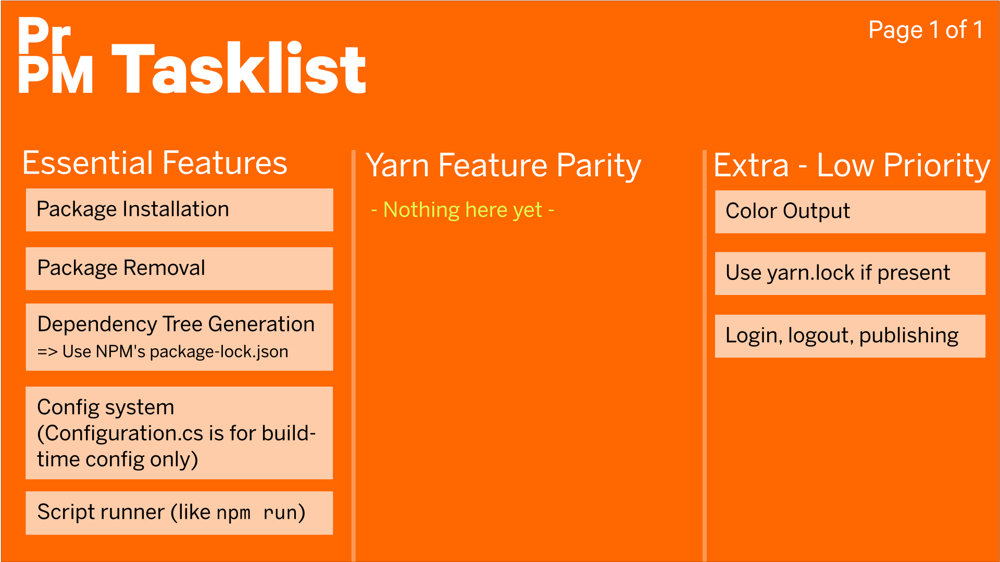

# PrPM - The *progressive* JS package manager  
  
  
  
PrPM is an NPM-compatible package manager that is written completely in the C# programming language.  
  
Using **.NET Core**, it is completely cross-platform and works on Linux, Windows and macOS (latter is untested).  
  
It should not be used anywhere, as it is not only not production-ready, it doesn't even support any of the main features of NPM/Yarn yet. 
  
The `package.json` included in this repository is for testing. Please do not try to install it.
  
## Tasklist / Roadmap  
  
